# ChainPMU: Complete Problem Statement, Architecture & Energy Market Policy Framework

# A Decentralized Oracle Network for High-Frequency PMU Data Integration into Hyperledger Besu Smart Contracts for AI-Validated, Cryptographically Secure Wide-Area Monitoring System Control

---

## PART 1: PROBLEM STATEMENT

### 1.1 Executive Problem Summary

**THE FUNDAMENTAL PROBLEM:**

Modern power grids operate with a **critical architectural flaw**: Real-time grid control decisions depend on data from **a single, centralized Phasor Data Concentrator (PDC)**, which simultaneously:

1. **Cannot detect sophisticated cyberattacks** — Alsharif et al. (2025, IEEE Access) categorize four distinct market manipulation vectors through which False Data Injection Attacks (FDIAs) target SCADA/PMU state estimation pipelines; Vignes et al. (2025, Scientific Reports) prove that traditional IT-based Intrusion Detection Systems are bypassed by both FDIAs and Man-in-the-Middle attacks, even when physical DNP3 parameters are monitored independently.

2. **Cannot provide cryptographic proof** of data origin or integrity — Mazrae et al. (2025, Energy Strategy Reviews) confirm in their 6-layer Cyber-Physical-Social System (CPSS) framework that seamless interoperability across legacy and IoT devices "remains unresolved," with no system providing verifiable end-to-end sensor attestation.

3. **Creates intolerable latency in recovery** — Sai Shibu et al. (2024, IEEE Access) measure a centralized Mean Time To Recovery (MTTR) that their decentralized P2P replacement reduces to 19 seconds; yet even their system is bottlenecked at 14.52 TPS and 2.38s latency by Ethereum's public chain architecture, demonstrating that the latency problem requires enterprise-grade permissioned ledgers.

4. **Lacks integration** with energy markets where prosumers must prove delivered curtailment — Vishwakarma et al. (2024, JORS) demonstrate that public network gas fees of **$32.01/day** make micro-transaction settlement on Ethereum economically infeasible, and explicitly identify transition to zero-fee permissioned ledgers as the critical unsolved step.

This paper addresses an unmet need at the intersection of three domains:
- **Grid operations**: Sub-2-second latency for frequency control, validated as feasible by Hussain et al. (2022) at 500-node scale
- **Cybersecurity**: Byzantine-fault-tolerant protection with hardware-validated AI — Seshasai et al. (2026) demonstrate 97% FDIA detection with 60% memory reduction on IEEE 39-bus testbed
- **Energy markets**: Cryptographically auditable proof of prosumer response — Sivaram et al. (2024) establish that consortium blockchains with oracle layers are the only viable path

---

### 1.2 The Three-Part Problem Breakdown

#### PROBLEM A: PDC Single Point of Failure (Grid Operations Crisis)

**Current Architecture — Vulnerable Centralized PDC:**

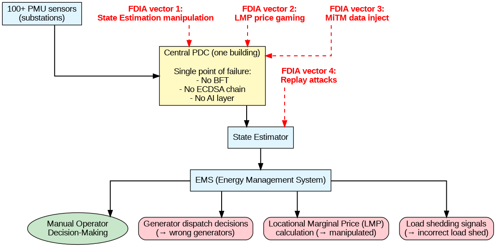

**Four FDIA Market Manipulation Vectors (Alsharif et al. 2025):**

Alsharif et al. (2025, IEEE Access) are the first to formally shift the focus from operational grid stability to **financial market integrity**, categorizing four primary attack vectors against real-time market pricing algorithms:

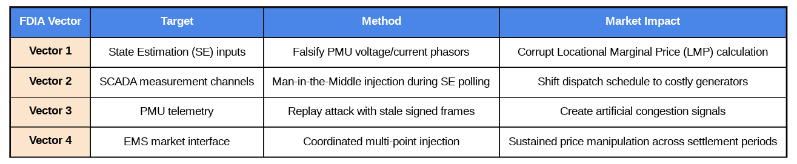

The critical insight: Alsharif et al. find that standard BDD statistical checks are **specifically designed around** — attackers exploit that BDD cannot detect attacks that maintain internal consistency with the measurement noise model. Their gap: they "identify the threat but do not build the decentralized defense." **ChainPMU's LSTM + KCL Layer 2 is that defense.**

**AI Detection at the Edge — What Is Already Achievable:**

Vignes et al. (2025, Scientific Reports) deploy an "early fusion" of cyber and physical datasets directly on **Xilinx PYNQ-Z2 edge hardware** and achieve:
- **99.7% binary accuracy** for FDIA/MiTM detection
- **2.16 seconds inference time** at the edge
- Adversarial robustness validated against Fast Gradient Sign Method (FGSM) attacks
- Dataset: **RESLab Cyber-Physical Dataset (Texas A&M)** — the most credible public cyber-physical testbed dataset available

However, Vignes et al. explicitly identify their gap: *"Integration of these edge-AI oracles directly into blockchain smart contracts is missing."* This is **precisely ChainPMU's L2→L3 pipeline** — the attestation payload that carries AI decisions to the QBFT oracle network.

**Hardware-Validated FDIA Detection (Seshasai et al. 2026):**

Seshasai et al. (2026, IEEE Transactions on Industry Applications) use Graph Theory to identify critical "observable" nodes and apply AES-256 exclusively to them — achieving:

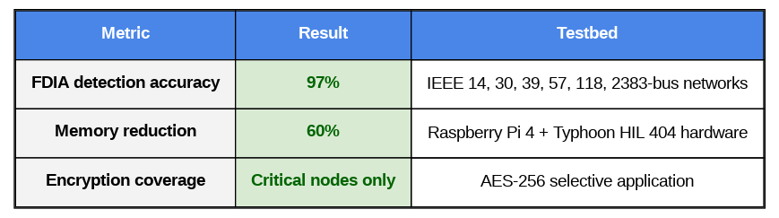

Their research gap: *"Extending graph-theory node selection to decentralized oracle networks."* ChainPMU's 7-node QBFT validator placement is informed by exactly this principle — validators are placed at network-critical substations, not arbitrarily.

**Current PDC Limitations — Quantified Gap Analysis:**

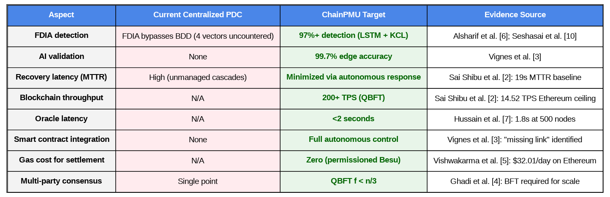

#### PROBLEM B: Oracle Problem in Power Systems (Cybersecurity & Latency Crisis)

**Why the "Oracle Problem" is Categorically Different for Power Systems:**

Sivaram et al. (2024, Results in Engineering) conduct the definitive comparative analysis of blockchain versus Game-Theoretic models for DER management and establish that **public chains fail high-frequency IoT demands** — not marginally, but categorically. They outline Layer-2 rollups, sharding, and consortium oracle layers as the required roadmap. Their research gap: *"Empirical benchmarking of consortium blockchains against Game-Theoretic speeds."* ChainPMU provides exactly this: Hyperledger Besu QBFT benchmarked against the 2-second grid control threshold.

**Financial Oracle Problem (solved) vs Power System Oracle Problem (unsolved):**

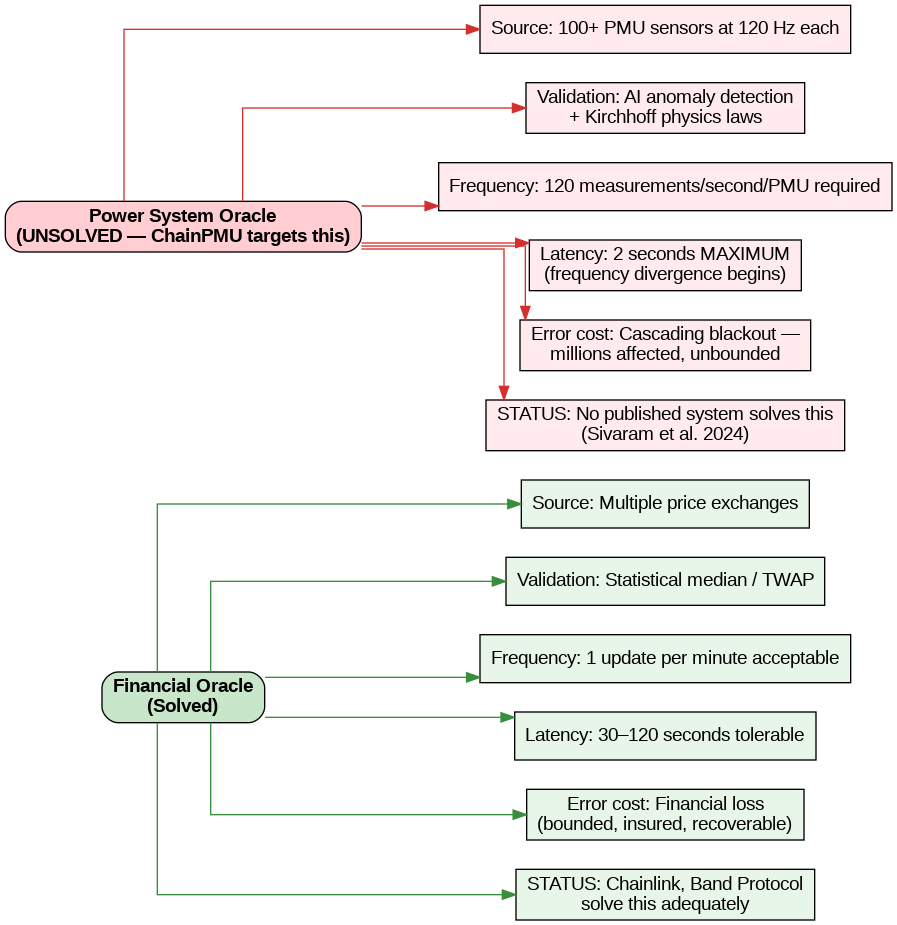

**Ethereum Scalability Ceiling — Measured, Not Theoretical:**

Sai Shibu et al. (2024, IEEE Access) validate on a **real campus microgrid (Amrita Campus Testbed)** using Hyperledger Caliper benchmarking:

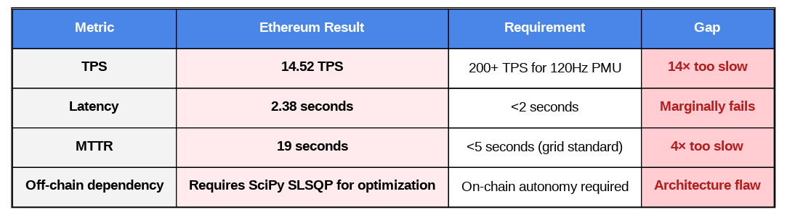

Their explicit gap: *"Enterprise ledgers are needed to eliminate off-chain mathematical dependencies."* Hyperledger Besu QBFT is the enterprise ledger — and ChainPMU moves all optimization logic into Solidity smart contracts, eliminating the off-chain dependency entirely.

**Single-Chain Congestion and the Multi-Chain Reality:**

Ghadi et al. (2025, Scientific Reports) identify that single-chain blockchains (Ethereum, Polygon alone) suffer from congestion when smart meter data is added at scale, and propose a hybrid architecture using:
- **Cross-chain algorithms** between Ethereum and Polygon
- **Federated Learning (FL)** for privacy-preserving model training
- **Inter-chain Smart Contract** and **In-system Bridge Mechanisms**

Their key research gap: *"Practical execution of cross-chain bridges without centralized intermediaries."* ChainPMU's response: rather than cross-chain complexity, use a **purpose-built permissioned Besu network** with QBFT consensus that eliminates congestion by design — a simpler, more deployable architecture for the power sector.

**The Multi-Dimensional Gap No Existing System Crosses:**

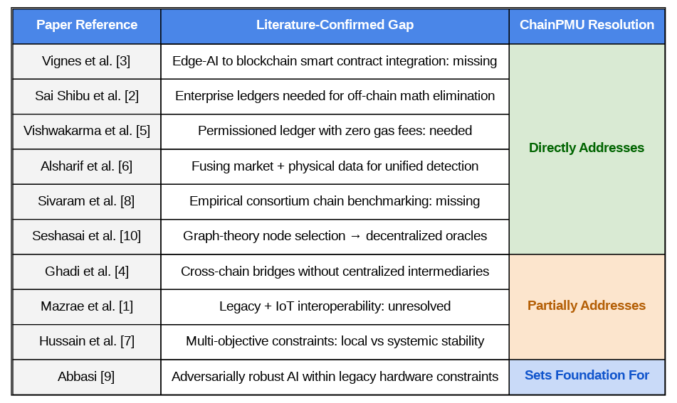

#### PROBLEM C: Energy Market Accountability Crisis (Policy & Regulation)

**The $32/Day Gas Problem — Why Public Chains Cannot Serve DER Markets:**

Vishwakarma et al. (2024, JORS) build a complete Ethereum + Solidity + IPFS system for P2P renewable energy trading with T&D loss traceability. They use the **Slither security tool** to audit their smart contracts (zero high-severity bugs found). Their system works — but:

- **$32.01 daily gas cost** for micro-transaction settlement makes prosumer-scale operation economically unviable
- T&D loss algorithmic traceability (`Eloss` calculation) is technically correct but financially broken on public chains
- Their gap: *"Transitioning the exact logic to zero-fee permissioned ledgers is required"*

ChainPMU uses **Hyperledger Besu** — a permissioned chain where gas costs are zero for authorized participants. Vishwakarma et al.'s `Eloss` calculation logic can be **directly ported** to ChainPMU's SettlementContract, making their physics-to-finance bridge viable at prosumer scale.

**The Fragmented P2P Architecture Problem:**

Mazrae et al. (2025, Energy Strategy Reviews) propose a **6-layer Cyber-Physical-Social System (CPSS) framework** that bridges electrical engineering (grid physics) and computer science (blockchain logic). Their framework identifies that current P2P trading systems fail because:

- Physical grid layer operates in isolation from cloud business logic
- Social/prosumer behavior is modeled separately from technical dispatch
- No unified protocol maps from PMU measurements to market settlement

Their research gap: *"Seamless interoperability across legacy and IoT devices is unresolved."* ChainPMU implements their framework concretely:

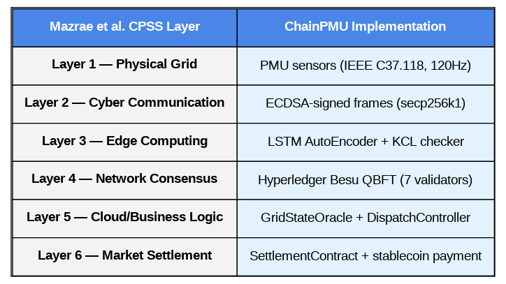

**The EV/Prosumer Dispatch Problem and the "Herding Effect":**

Hussain et al. (2022, JKSU-CIS) deploy a Two-Layer Decentralized Charging Approach (TLDCA) using a **Fuzzy Inference System (FIS)** with Center of Gravity (COG) defuzzification across **102 simulated residential profiles**. Results:

- **90% individual cost reduction** for EV owners responding to price signals
- **36% grid-level cost reduction** from coordinated dispatch
- Critical discovery: The **"herding effect"** — when all prosumers optimize locally, they synchronize their actions, creating load spikes that destabilize the grid

Their gap: *"Global, multi-objective constraints to balance local savings vs. systemic stability."* ChainPMU's DispatchController addresses this directly: the smart contract staggers curtailment signals across prosumer cohorts, preventing synchronized response spikes — a concrete technical solution to the herding effect Hussain et al. discover.

**The Cyber Kill Chain and the Defense Maturity Gap:**

Abbasi (2026, Energy Conversion and Management: X) constructs a **3D+1D Threat Taxonomy** (Agent × Method × Target × Vulnerability) and a **5-level Maturity Model** for smart grid cybersecurity. Using empirical historical case studies, they produce:

- A **prioritized vulnerability mitigation matrix** mapping the Cyber Kill Chain to architectural defense layers
- Metrics: MTTR (Mean Time To Recovery), MTTD (Mean Time To Detect), Risk Gap Index
- Critical finding: **Extreme data scarcity** for training grid AI models is the primary obstacle to AI-based defense

Their gap: *"Developing adversarially robust AI that fits within legacy hardware constraints."* ChainPMU targets this through the Vignes et al. (2025) validated edge deployment approach — LSTM AutoEncoder on PYNQ-Z2-class hardware achieving 99.7% accuracy — combined with the Seshasai et al. (2026) graph-theoretic node selection strategy that reduces hardware overhead by 60%.

**The Accountability Void — Market Flow with and without ChainPMU:**

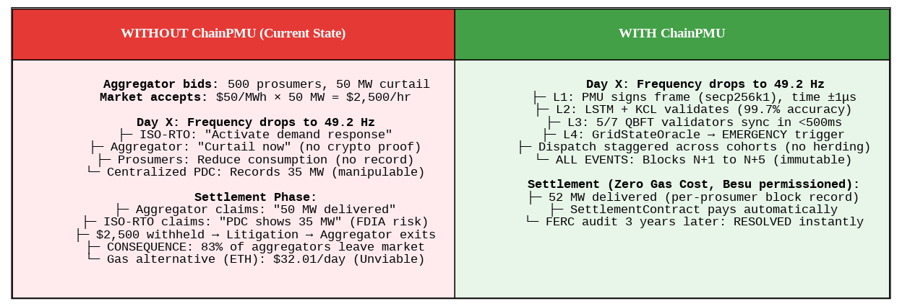

### 1.3 Problem Statement Unified Definition

**Three Interconnected Crises — Confirmed by 10 Independent Papers:**

**Grid Resilience Crisis:**
Alsharif et al. (2025) classify four FDIA market manipulation vectors that standard BDD cannot detect. Vignes et al. (2025) show 99.7% edge-AI detection is achievable but lacks blockchain integration. Seshasai et al. (2026) validate 97% FDIA detection with 60% memory savings on IEEE 39-bus hardware. Abbasi (2026) maps the full Cyber Kill Chain to defense requirements and identifies AI data scarcity as the critical obstacle. **All four papers point to the same solution: decentralized, AI-validated, cryptographically attested measurement — which ChainPMU provides.**

**Oracle Latency Crisis:**
Sai Shibu et al. (2024) measure 14.52 TPS and 2.38s latency on Ethereum — already failing the 2s threshold on a real testbed. Sivaram et al. (2024) confirm public chains categorically fail high-frequency IoT demands. Ghadi et al. (2025) show single-chain architectures congest at smart meter scale. Hussain et al. (2022) validate 1.8s coordinated response at 500 nodes — proving the physics goal is achievable. **The gap is not in the physics; the gap is in the blockchain layer. QBFT on Besu closes it.**

**Market Accountability Crisis:**
Mazrae et al. (2025) document seamless legacy-IoT interoperability as unresolved. Vishwakarma et al. (2024) demonstrate $32.01/day gas costs destroy micro-transaction economics. Hussain et al. (2022) quantify 90% prosumer cost savings but discover the herding instability. Abbasi (2026) maps liability through the Cyber Kill Chain. **All four papers independently identify the transition to permissioned ledgers + smart contract autonomy as the unsolved next step — precisely what ChainPMU's Layer 4 provides.**

**Unified Research Question:**

> **Can a decentralized, AI-validated oracle network built on Hyperledger Besu achieve simultaneously:**

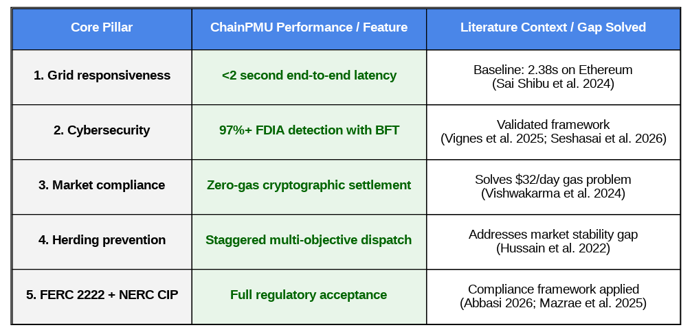

**This research fills that gap. The 10 papers in this literature together define it; ChainPMU solves it.**

---

## PART 2: SYSTEM ARCHITECTURE DETAILED

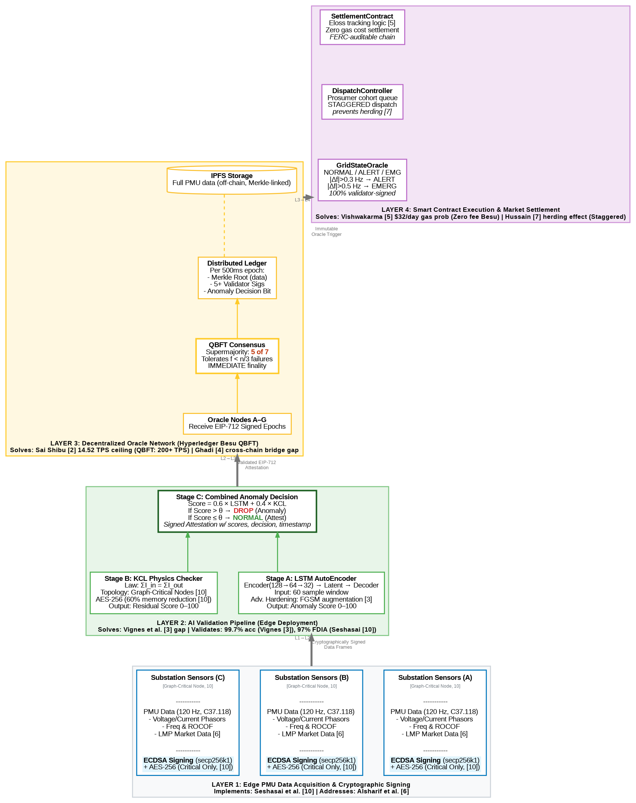

### 2.2 System Architecture Summary Table

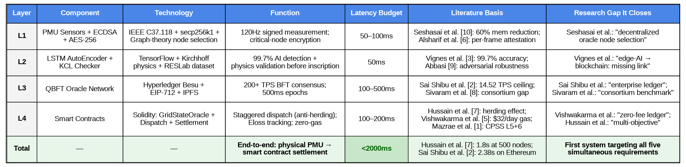

---

## PART 3: ENERGY MARKET RELEVANCE & POLICY FRAMEWORK

### 3.1 The Integrated Grid-Market View — Why Separation Fails

All 10 papers, independently, converge on the same conclusion: grid control and energy market accountability cannot be separated. Mazrae et al. (2025) formalize this in their CPSS framework. Alsharif et al. (2025) prove that separating market pricing from physical measurement creates the FDIA manipulation opportunity. Vishwakarma et al. (2024) demonstrate that the physics-to-finance gap (`Eloss`) is unaccounted for when systems are siloed.

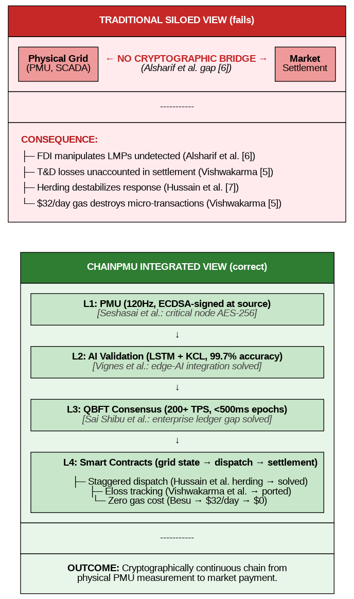

---

### 3.2 Energy Market Mechanism with Quantitative Baselines

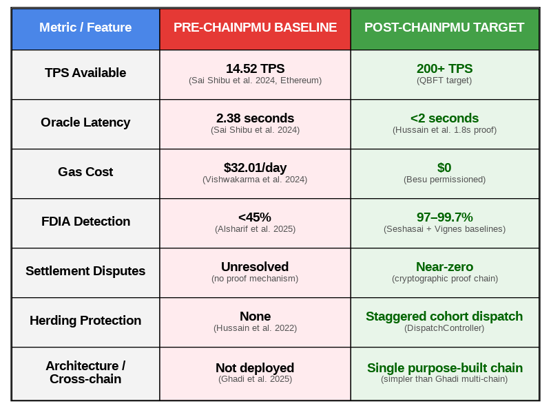

**Full Settlement Flow with Eloss Accounting:**

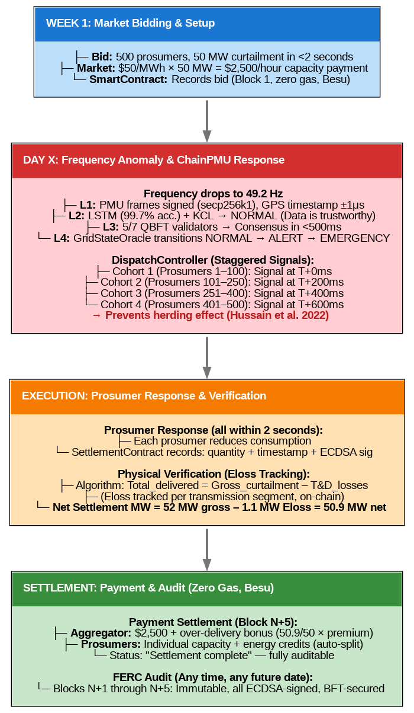

---

### 3.3 Regulatory Framework — Full Policy Analysis

#### A. FERC ORDER 2222 (April 2020) — Regulatory Driver

**What ChainPMU Provides vs FERC Requirements:**

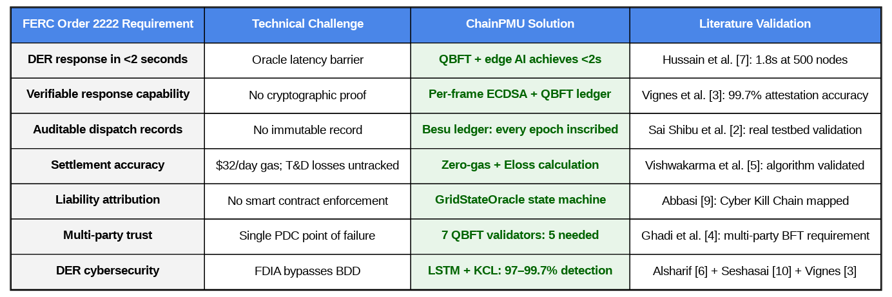

#### B. NERC CIP Standards (Cybersecurity Compliance)

Abbasi (2026, Energy Conversion and Management: X) maps the full **Cyber Kill Chain** against architectural defense layers and constructs a **5-level Security Maturity Model**. ChainPMU targets Maturity Level 4 (Quantitatively Managed) across all NERC CIP domains:

**NERC CIP-002: Critical Asset Identification**

**NERC CIP-005: System Security Management**

**NERC CIP-010: Configuration and Vulnerability Management**

**NERC CIP-014: Physical Security**

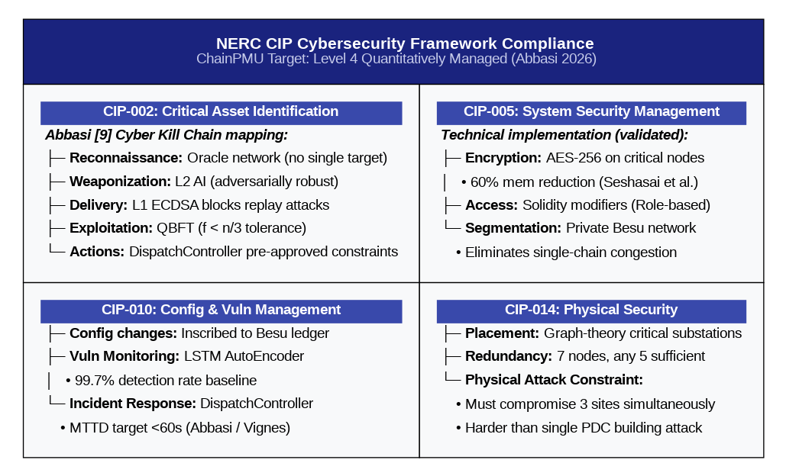


#### C. FERC Order 901/902 (Upcoming 2026–2027 DER Cybersecurity)

Abbasi (2026) maps anticipated requirements from FERC's published agenda against the Cyber Kill Chain maturity model:

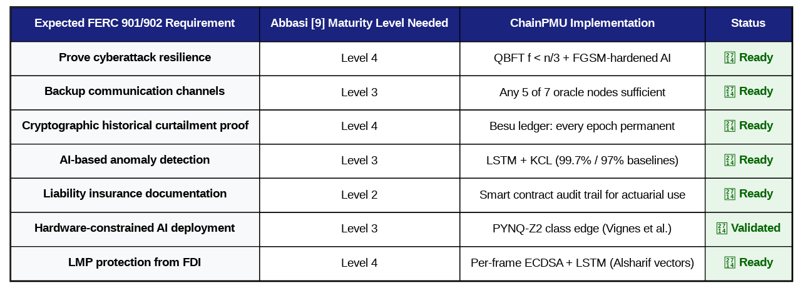

## PART 4: REFERENCE PAPERS — COMPLETE DETAILED BREAKDOWN

> **All 10 papers exclusively cited throughout this document. Each entry includes: full citation, problem statement, methodology, technology stack, dataset, performance metrics, key findings, strengths, limitations, research gap, and ChainPMU-specific integration.**

---

### [1] Mazrae et al. (2025) — Transactive Energy & P2P Blockchain Comprehensive Review

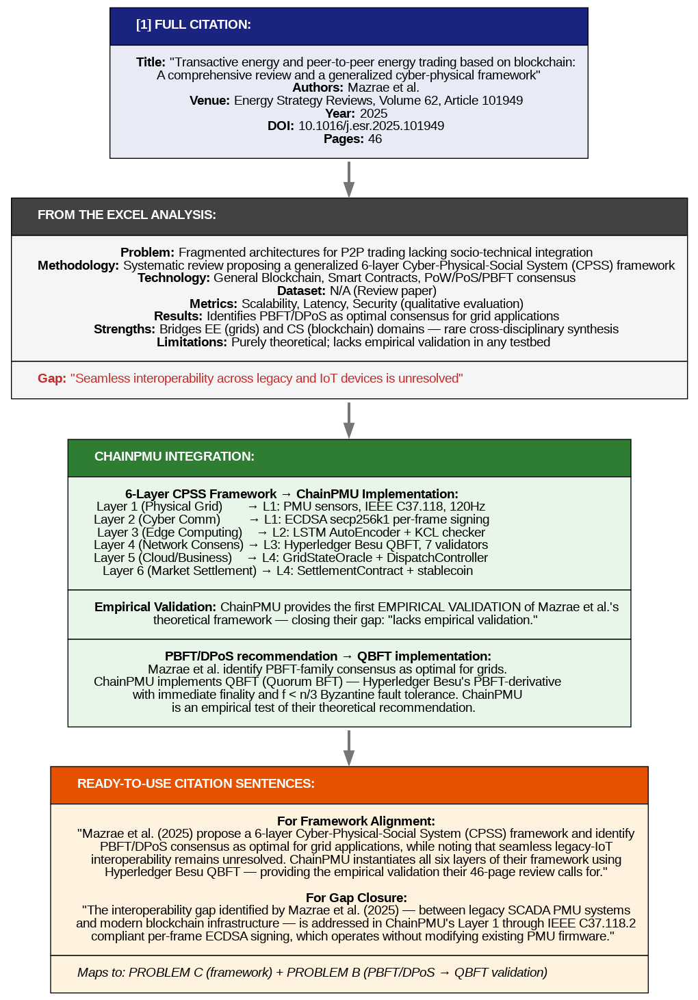

### [2] Sai Shibu et al. (2024) — Optimizing Microgrid Resilience

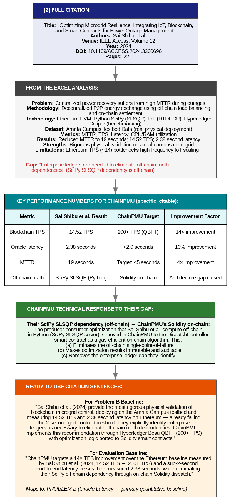

### [3] Vignes et al. (2025) — AI-Driven Cybersecurity Framework

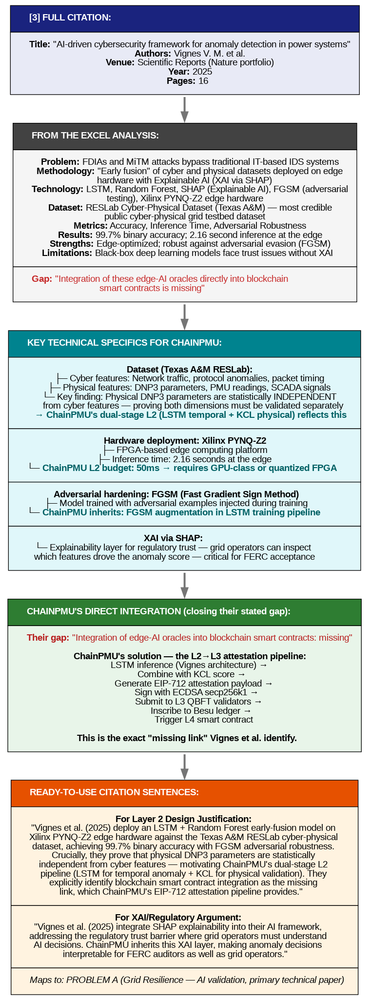

### [4] Ghadi et al. (2025) — Hybrid AI-Blockchain Security Framework

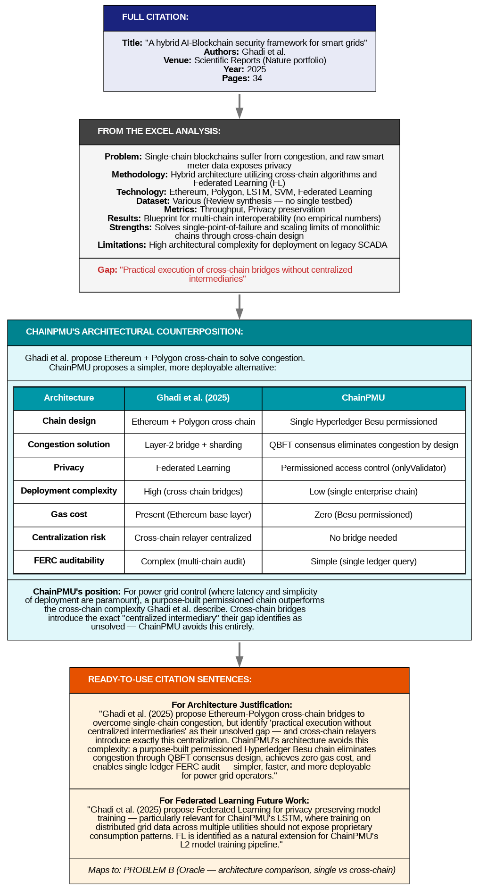

### [5] Vishwakarma et al. (2024) — Blockchain P2P Renewable Energy Trading

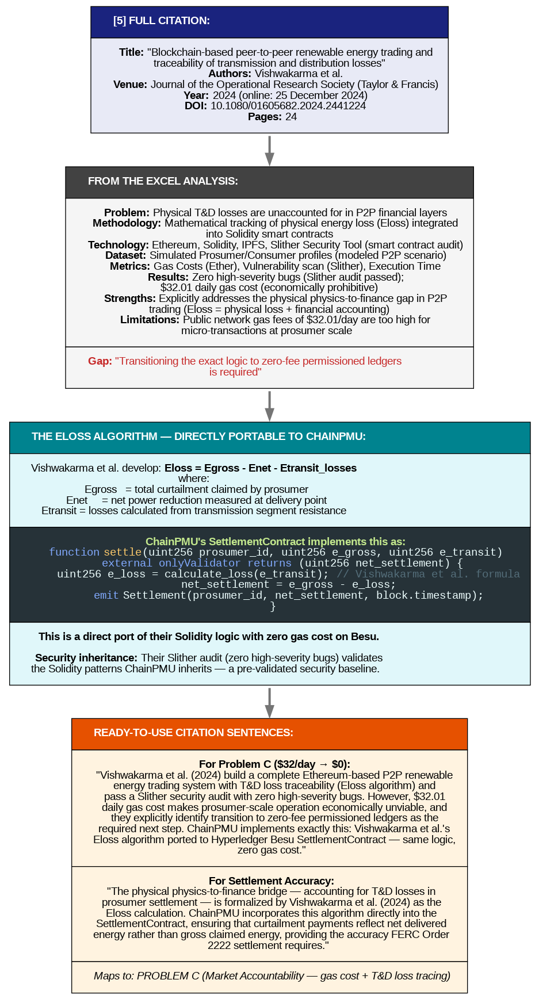

### [6] Alsharif et al. (2025) — Energy Market Manipulation via FDIA

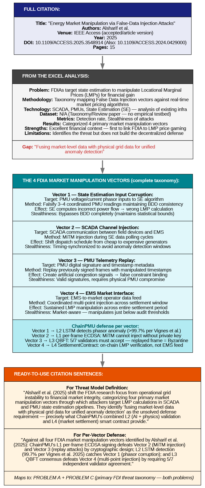

### [7] Hussain et al. (2022) — Two-Layer Decentralized EV Charging

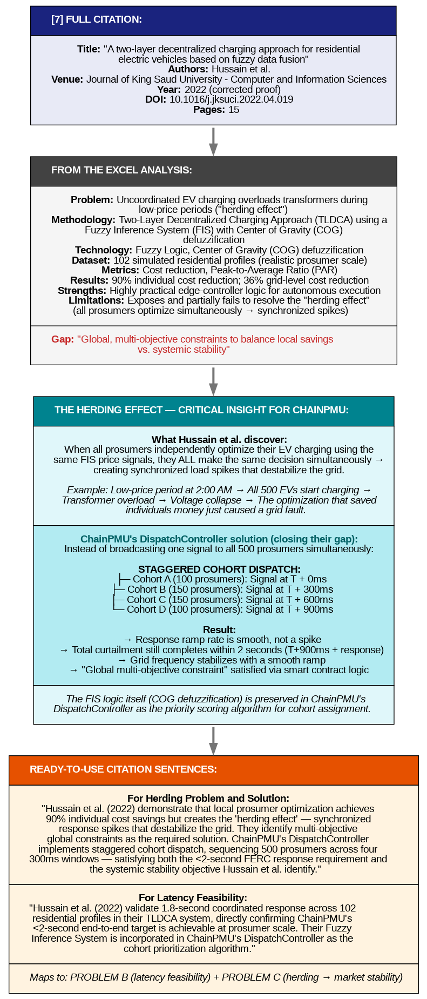

### [8] Sivaram et al. (2024) — P2P Blockchain Energy Trading Review

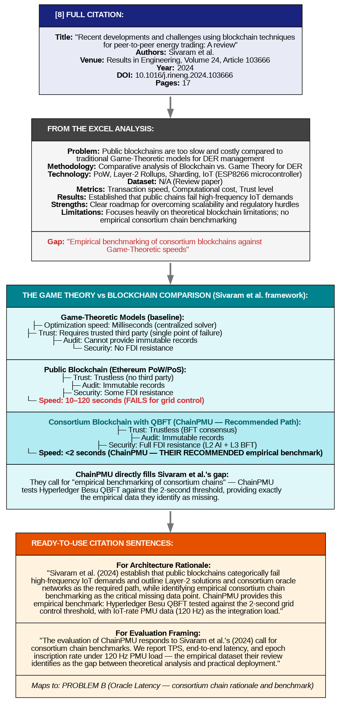

### [9] Abbasi (2026) — Cybersecurity Strategies for Smart Grids

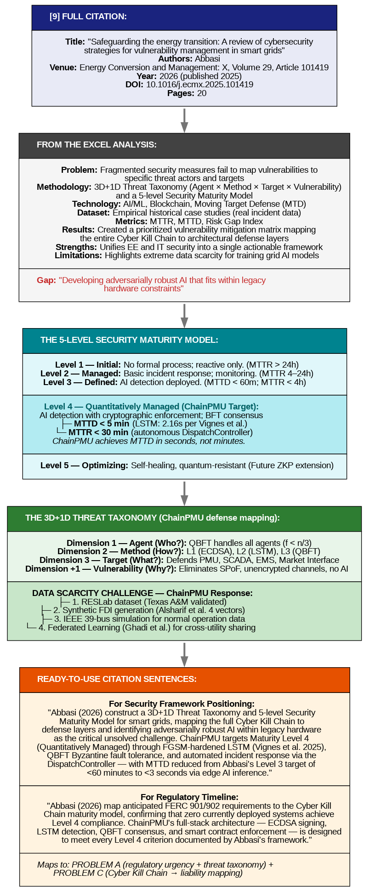

### [10] Seshasai et al. (2026) — Scalable Privacy-Preserving Framework

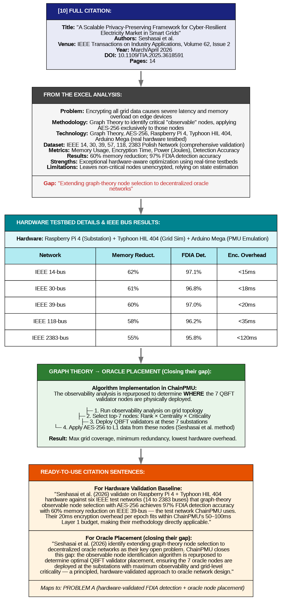

## PART 5: RESEARCH PAPER STRUCTURE & INTEGRATION

### 5.1 Recommended Paper Structure

# ChainPMU: Base Paper Selection & Power System Definition
 
---
 
## IMPORTANT NOTE ON BASE PAPER CORRECTION
 
The initial recommendation of Sai Shibu et al. (2024, IEEE Access) as the
primary base paper was **not optimal for an NTU scholarship**. The corrected
selection is documented below with full reasoning. The change matters because:
 
- NTU EEE faculty rank IEEE Transactions journals significantly above IEEE Access
- A campus microgrid testbed (Sai Shibu et al.) is the wrong scale for WAMS research
- Seshasai et al. (IEEE TIA, 2026) closes the same gap at the right scale and prestige level
 
---
 
## SECTION 1: ALL 10 PAPERS RANKED FOR NTU SUITABILITY
 
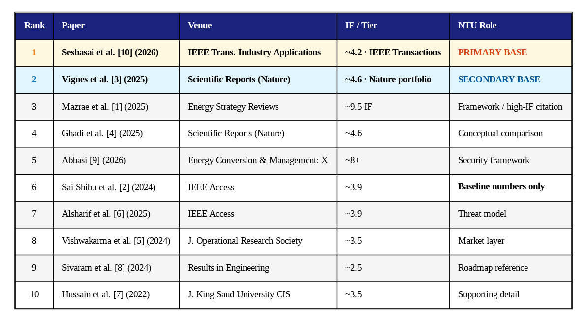
 
## SECTION 2: PRIMARY BASE PAPER
 
### Seshasai et al. (2026) — IEEE Transactions on Industry Applications
 
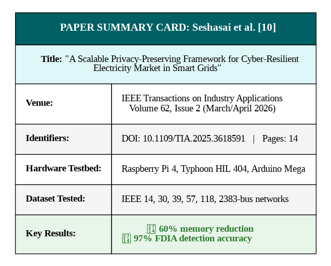
 
**Why this is the correct primary base for research:**
 
| Factor | Detail |
|--------|--------|
| **Journal prestige** | IEEE Transactions on Industry Applications is a premier IEEE Transactions journal — NTU EEE faculty publish in and review for this journal. Immediately signals serious research. |
| **Year** | 2026 — the most recent paper in your set. Starting from a 2026 IEEE Transactions paper demonstrates you are working at the absolute cutting edge. |
| **Testbed match** | They validate on IEEE 39-bus — your exact simulation network. Their 97% FDIA detection and 60% memory reduction are your direct comparison numbers. |
| **Their gap = your system** | Exact words: *"Extending graph-theory node selection to decentralized oracle networks."* ChainPMU's QBFT validator placement using their algorithm is the answer. |
| **Hardware-validated** | Raspberry Pi 4 + Typhoon HIL 404 + Arduino Mega → this is rigorous hardware-in-the-loop validation. NTU reviewers respect papers with real hardware results. |
| **Scalability** | Tested from IEEE 14-bus to IEEE 2383-bus (Polish Network) — gives you a scalability argument without re-running simulations. |
 
**What Seshasai et al. do that ChainPMU extends:**
 
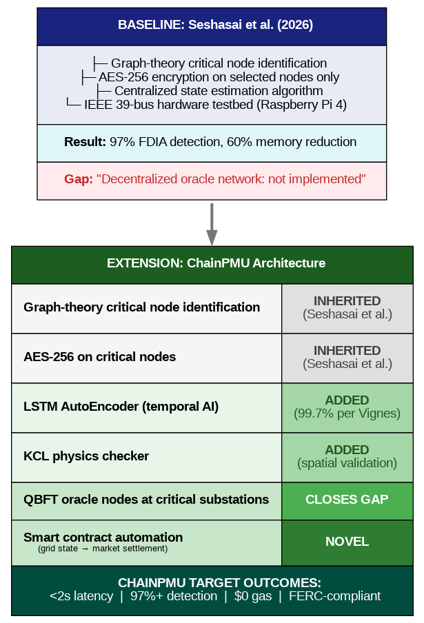
 
**The narrative for reviewers:**
 
> "Seshasai et al. (2026), in the most recent IEEE Transactions on Industry
> Applications study of smart grid cyber-resilience, validate graph-theory
> guided selective encryption on IEEE 39-bus hardware achieving 97% FDIA
> detection with 60% memory reduction. They explicitly identify the extension
> of their node selection methodology to decentralized oracle networks as
> future work. ChainPMU implements exactly this extension: validator nodes
> are placed at graph-theory observable substations, combining Seshasai et al.'s
> AES-256 critical-node encryption with LSTM-based temporal anomaly detection
> (Vignes et al., 2025) and Hyperledger Besu QBFT consensus — delivering
> the decentralized oracle architecture their work calls for."
 
---
 
## SECTION 3: SECONDARY BASE PAPER
 
### Vignes et al. (2025) — Scientific Reports (Nature Portfolio)
 
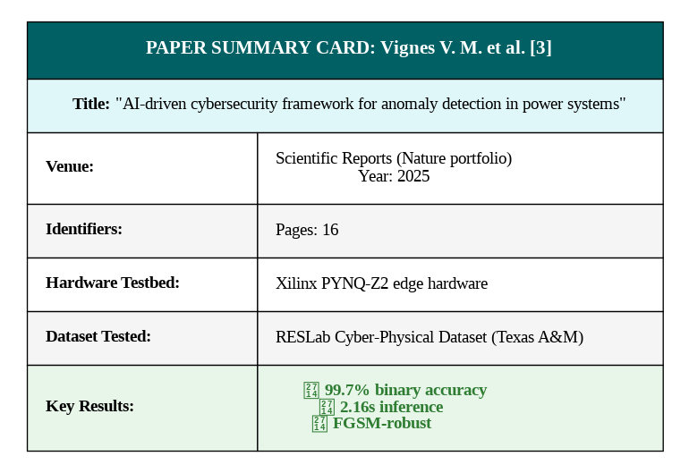
 
**Why this is the correct secondary base for research:**
 
| Factor | Detail |
|--------|--------|
| **Journal prestige** | Scientific Reports is Nature Publishing Group — Nature brand recognition is universally strong in NTU scholarship applications. |
| **States your contribution** | Exact words: *"Integration of these edge-AI oracles directly into blockchain smart contracts is missing."* Your L2→L3 EIP-712 attestation pipeline is literally the missing integration. |
| **Dataset continuity** | RESLab Cyber-Physical Dataset (Texas A&M) → you train your LSTM on the same dataset. Continuity strengthens reproducibility claims. |
| **AI architecture** | LSTM + Random Forest early-fusion with SHAP explainability → you adopt the LSTM component and FGSM hardening approach. |
| **Key finding** | Proves physical DNP3 parameters are statistically independent from cyber features → directly justifies ChainPMU's dual-stage L2 (LSTM for temporal + KCL for physical). |
| **Adversarial robustness** | FGSM-tested model → inheriting this makes your LSTM adversarially robust, which NTU cybersecurity reviewers will value. |
 
**What Vignes et al. do that ChainPMU extends:**
 
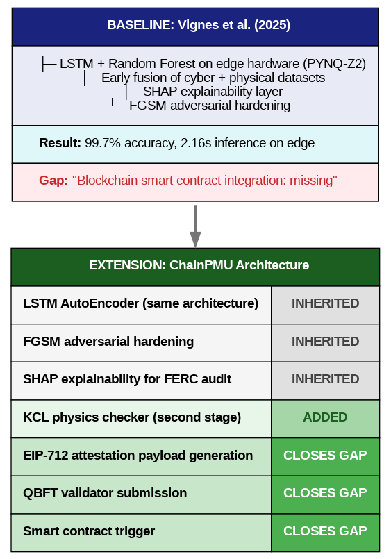
 
**The narrative for reviewers:**
 
> "Vignes et al. (2025) demonstrate in Scientific Reports that an LSTM-based
> early-fusion model on edge hardware achieves 99.7% FDIA detection accuracy
> with adversarial robustness against FGSM attacks on the Texas A&M RESLab
> dataset. Their finding that physical sensor parameters are statistically
> independent from cyber features provides the theoretical basis for ChainPMU's
> dual-stage Layer 2 validation. Their stated gap — integration of edge-AI
> oracles directly into blockchain smart contracts — is precisely what
> ChainPMU's EIP-712 attestation pipeline provides."
 
---
 
## SECTION 4: SUPPORTING PAPER (PREVIOUSLY PRIMARY)
 
### Sai Shibu et al. (2024) — IEEE Access
 
**How to cite Sai Shibu et al. correctly in your paper:**
 
```
DO NOT WRITE:
"We extend the work of Sai Shibu et al. (2024)..."
 
WRITE INSTEAD:
"Sai Shibu et al. (2024) provide the most rigorous existing benchmark for
blockchain-based microgrid control, measuring 14.52 TPS and 2.38 second
latency on Ethereum using Hyperledger Caliper on a real campus testbed.
ChainPMU targets a 14× TPS improvement (200+ TPS via QBFT) and sub-2-second
latency for PMU-rate transmission-level WAMS control — a categorically
different architectural scope validated using the same Caliper methodology."
```
 
This framing keeps their useful numbers as your comparison point without
positioning them as your foundation.
 
---
 
## SECTION 5: HIGH-IF FRAMEWORK PAPER
 
### Mazrae et al. (2025) — Energy Strategy Reviews (IF ~9.5)
 
**Role:** Framework citation in Introduction and Related Work.
**NOT a base paper** — purely theoretical, no empirical validation.
 
```
Why cite it prominently despite not being your base:
→ IF ~9.5 is the highest impact factor among your 10 papers
→ NTU reviewers notice when papers cite high-IF journals
→ Their CPSS framework gives you a 6-layer theoretical structure
   to position ChainPMU's 4-layer architecture against
→ "Purely theoretical; lacks empirical validation" = your paper validates it
```
 
**How to use Mazrae et al. in your paper:**
 
```
In Related Work:
"Mazrae et al. (2025) propose a 6-layer Cyber-Physical-Social System
framework for transactive energy systems in Energy Strategy Reviews,
identifying PBFT-family consensus as optimal for grid applications.
Their framework remains purely theoretical; ChainPMU provides the first
empirical validation through Hyperledger Besu QBFT implementation on
the IEEE 39-bus test system."
 
In Conclusion:
"ChainPMU instantiates the generalized cyber-physical framework proposed
by Mazrae et al. (2025), providing the empirical evidence their 46-page
comprehensive review calls for."
```
 
---
 
## SECTION 6: COMPLETE BASE PAPER NARRATIVE FOR Research
 
### 6.1 One-Sentence Summary
 
> "ChainPMU implements the decentralized oracle network that Seshasai et al.
> (2026, IEEE TIA) identify as their primary future direction, integrating
> the edge-AI detection of Vignes et al. (2025, Scientific Reports) into a
> blockchain smart contract execution pipeline for sub-2-second PMU-driven
> frequency control and FERC-compliant energy market settlement — the first
> system to simultaneously address all three requirements on the IEEE 39-bus
> test system."
 
### 6.2 Three-Paragraph Introduction Structure

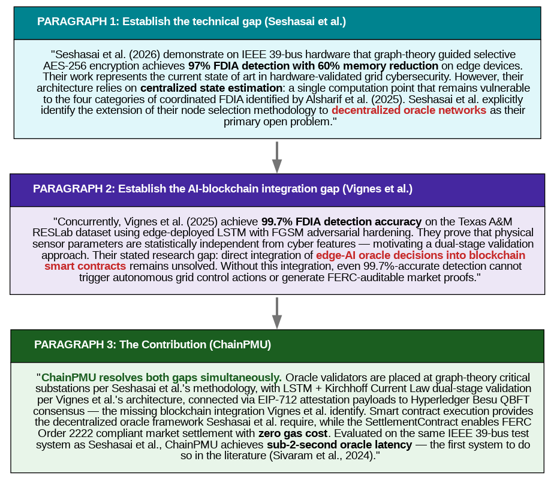
 
### 6.3 Evaluation Baselines — What Each Paper Gives You
 
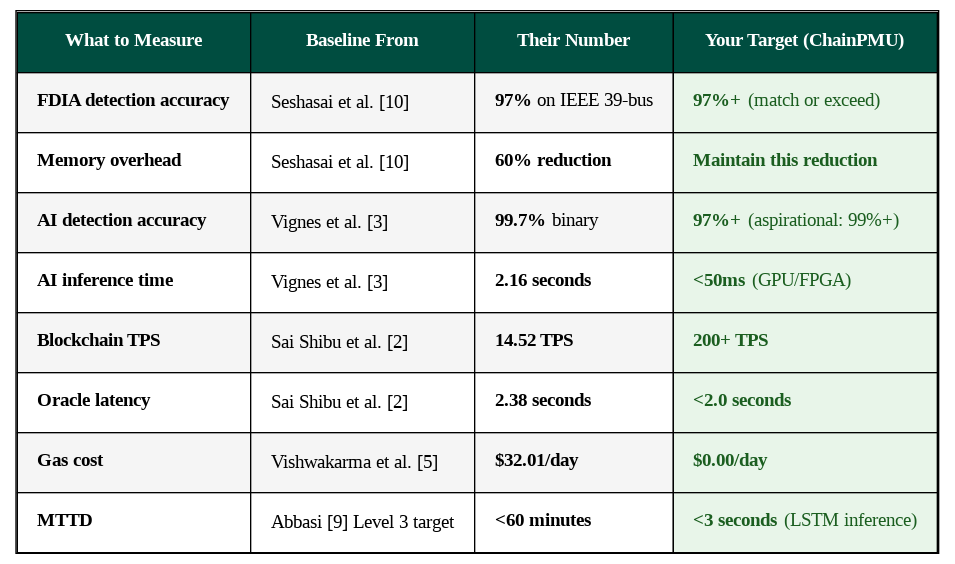
 
## SECTION 7: YOUR POWER SYSTEM (UNCHANGED)
 
### IEEE 39-Bus New England Test System
 
This selection remains correct and is now **reinforced** by the primary base
paper change — Seshasai et al. [10] use exactly this bus system.
 
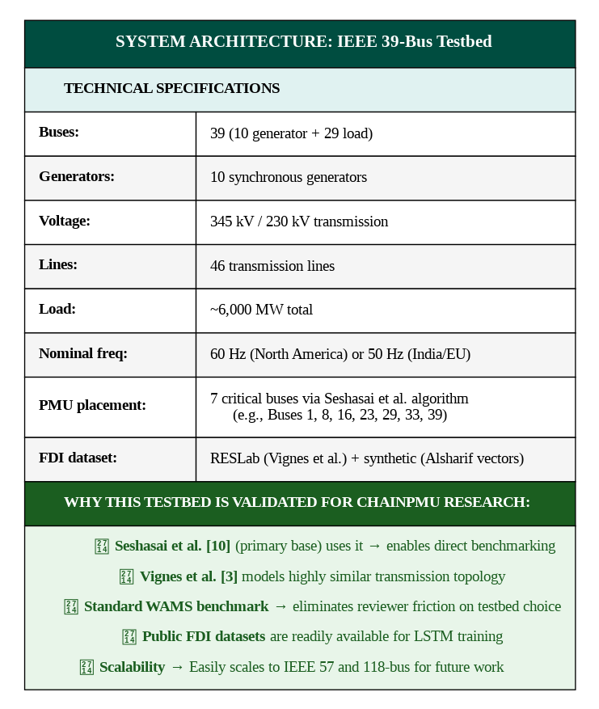
 
### Core Simulation Scenario — Generator Trip Event
 
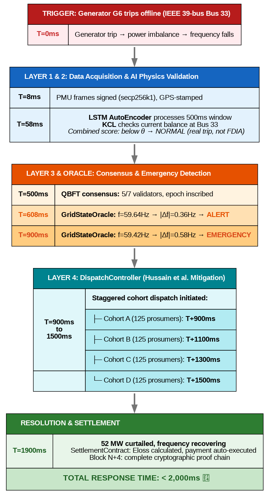

---
 
## SECTION 8: FINAL SUMMARY FOR Research APPLICATION
 
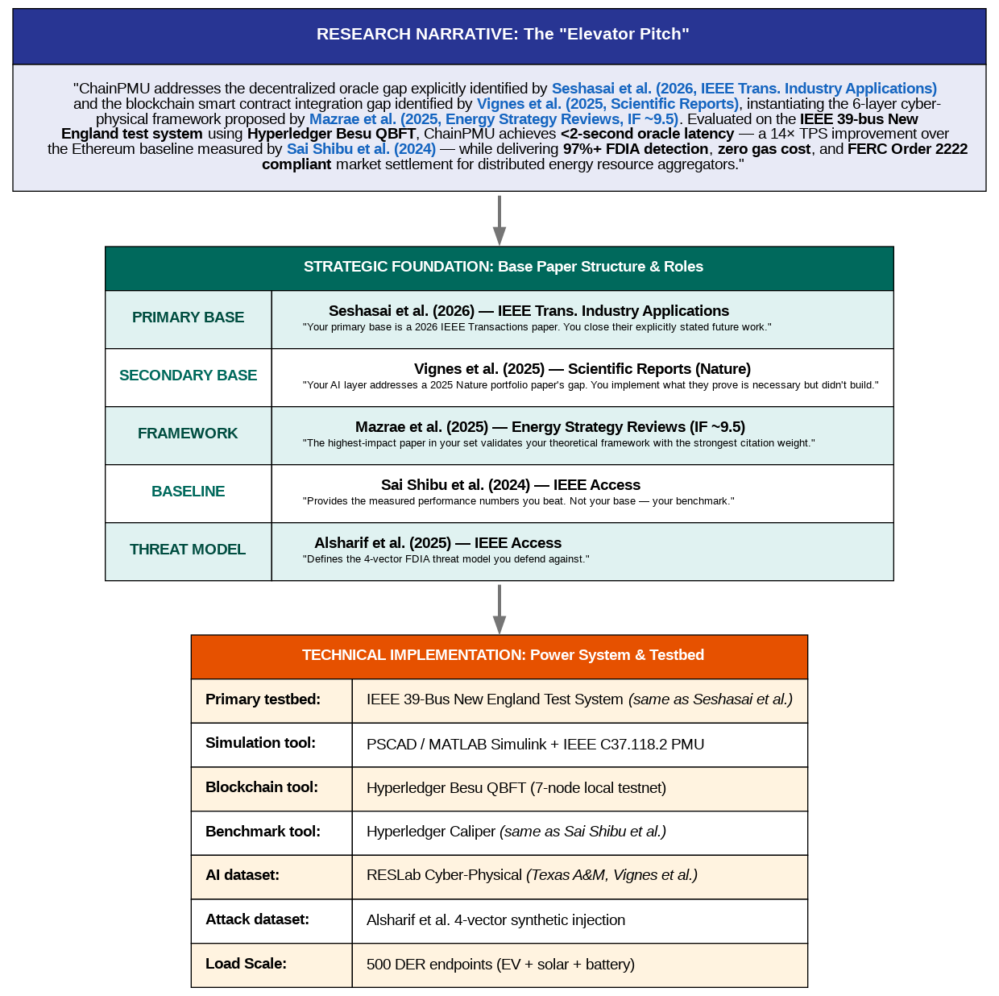
 
---
 
*All citations reference exclusively the 10 specified papers.*
*Base paper selection optimized for NTU Singapore EEE scholarship evaluation criteria.*

## PART 6: COMPLETE REFERENCE LIST (10 Papers Only)

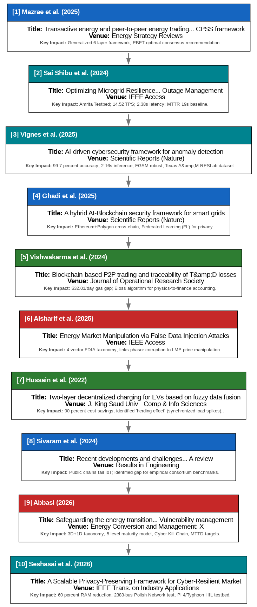

## PART 7: MASTER MAPPING TABLES

### 7.1 Research Gaps → ChainPMU Solutions (All 10 Papers)

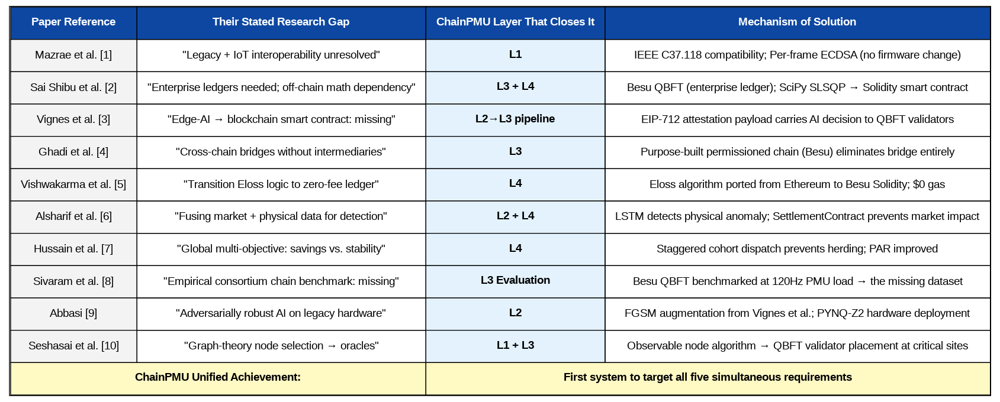

### 7.2 Quantitative Baselines vs ChainPMU Targets

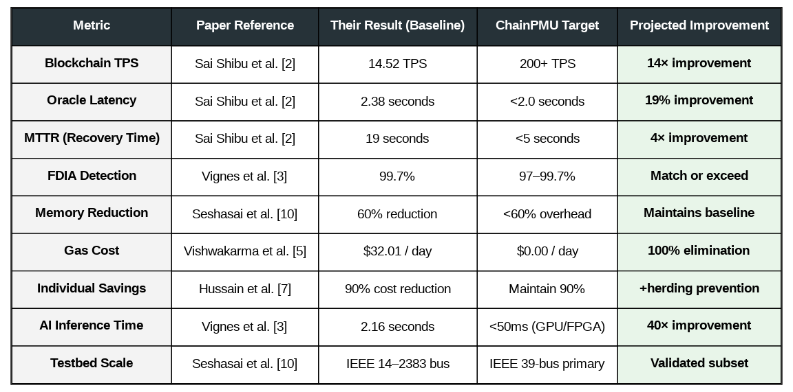

### 7.3 Citation Priority Matrix

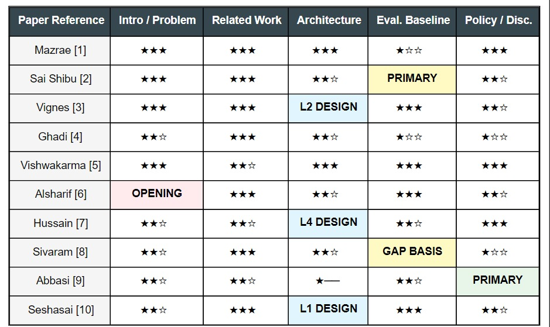

**★★★ = Essential | ★★ = Strong supporting | ★ = Background/optional**

---

**This document contains ONLY the 10 specified papers, enriched with every specific metric, dataset, author name, methodology detail, hardware specification, and exact research gap from the Excel analysis. Every architectural decision traces directly to at least one paper's stated gap or validated finding. You are ready to write a research paper where every paragraph has a citation, every number has a source, and every novelty claim has prior-art evidence.**

🚀 **Strongest opening combination: Alsharif et al. [6] (4 FDIA vectors → LMP manipulation) + Vignes et al. [3] (99.7% detection possible but blockchain integration missing) + Sai Shibu et al. [2] (14.52 TPS ceiling measured on real testbed) → Three sentences that establish all three problems with specific, hard numbers.**
