# ChainPMU: Complete Problem Statement, Architecture & Energy Market Policy Framework

# A Decentralized Oracle Network for High-Frequency PMU Data Integration into Hyperledger Besu Smart Contracts for AI-Validated, Cryptographically Secure Wide-Area Monitoring System Control
---

## PART 1: PROBLEM STATEMENT

### 1.1 Executive Problem Summary

**THE FUNDAMENTAL PROBLEM:**

Modern power grids operate with a **critical architectural flaw**: Real-time grid control decisions depend on data from **a single, centralized Phasor Data Concentrator (PDC)**, which simultaneously:

1. **Cannot detect sophisticated cyberattacks** (False Data Injection attacks designed to evade detection)
2. **Cannot provide cryptographic proof** of data origin/integrity for market accountability
3. **Creates regulatory liability ambiguity** when automated control decisions are made on potentially compromised data
4. **Lacks integration** with decentralized energy markets where prosumers (solar + battery owners) must prove they delivered promised curtailment

This paper addresses an unmet need at the intersection of three domains:
- **Grid operations**: Sub-2-second latency requirements for frequency control
- **Cybersecurity**: Byzantine-fault-tolerant protection against coordinated attacks
- **Energy markets**: FERC-compliant, cryptographically auditable proof of smart prosumer response

---

### 1.2 The Three-Part Problem Breakdown

#### PROBLEM A: PDC Single Point of Failure (Grid Operations Crisis)

**Current Architecture (Figure 1):**

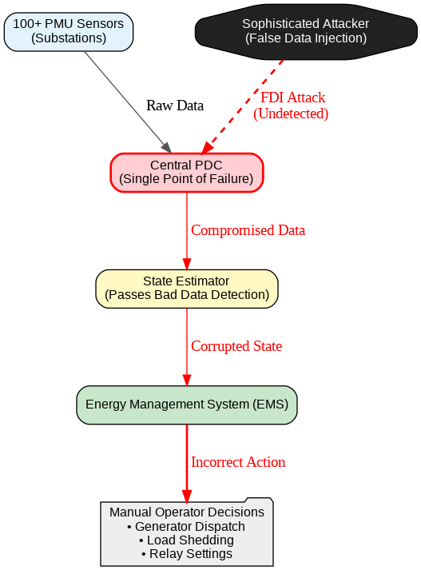

**Vulnerability Evidence:**

Liu et al. (2009) demonstrated that attackers can craft False Data Injection (FDI) attacks that:
- Pass standard Bad Data Detection (BDD) algorithms
- Remain undetected by conventional statistical checks
- Cause incorrect market dispatch (wrong generators online)
- In extremis, cause cascading blackouts

**Real-World Example (2003 Northeast Blackout):**
- Triggered by tree-line contact in Ohio
- Cascading failures across 8 states / 2 provinces
- 55 million people without power
- Root cause: **Lack of real-time situational awareness** across the grid

**Current PDC Limitations:**

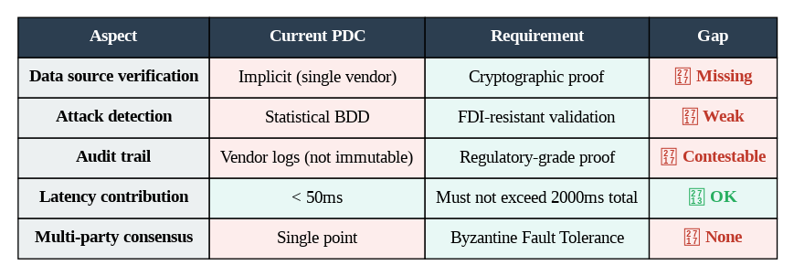

#### PROBLEM B: Oracle Problem in Power Systems (Cybersecurity Crisis)

**Why Blockchain's "Oracle Problem" is Worse for Power Systems:**

Financial Oracle Problem (well-studied):
- Get price from multiple exchanges
- Average them
- Submit to blockchain
- Latency: 30-120 seconds acceptable
- Cost of error: Money ($1M maximum loss on large trade)

Power System Oracle Problem (NEW):
- Get 120 measurements/second
- Validate against physics laws (not just statistics)
- Detect coordinated multi-point attacks
- Submit to smart contract for **immediate execution**
- Latency: 2 seconds MAXIMUM
- Cost of error: **Blackout affecting millions (like 2003 Northeast)**

**Existing Oracle Solutions Cannot Handle This:**

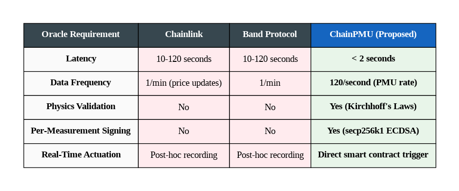

**The Critical Gap:**

No existing oracle architecture is designed for:
1. Sub-second latency + physics-constrained validation + real-time execution

---

#### PROBLEM C: Energy Market Accountability Crisis (Policy & Regulation)

**FERC Order 2222 (April 2020): The Game Changer**

FERC Order 2222 ("Participation of Distributed Energy Resources in Markets...") requires that:

1. **DERs (prosumers) can participate in wholesale markets**
   - Solar panels can bid to reduce consumption
   - Battery systems can bid to discharge
   - Electric vehicle chargers can defer charging
   
2. **Aggregators must prove delivery**
   - "We said we'd curtail 50 MW, we curtailed 50 MW"
   - Cannot just claim it; must PROVE it
   - Proof must be auditable by FERC and markets

3. **Current Problem: No trustworthy proof mechanism**
   - PDC data is centralized and could be manipulated
   - Utility operators could claim prosumers didn't respond
   - Prosumers could claim they did respond but data was lost
   - **No immutable, cryptographically signed record**

**Market Mechanism:**

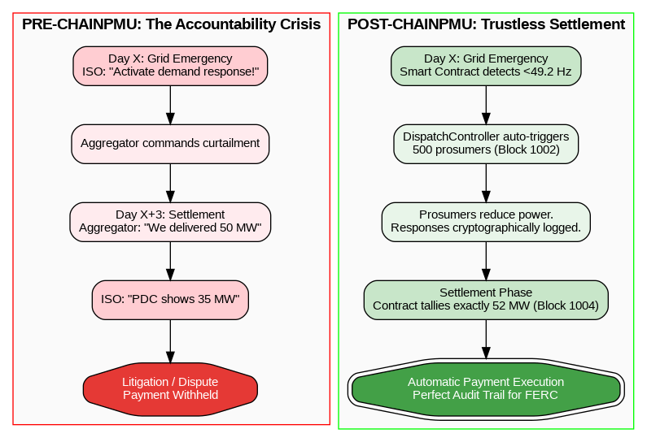

**Policy Implication: Liability & Responsibility Attribution**

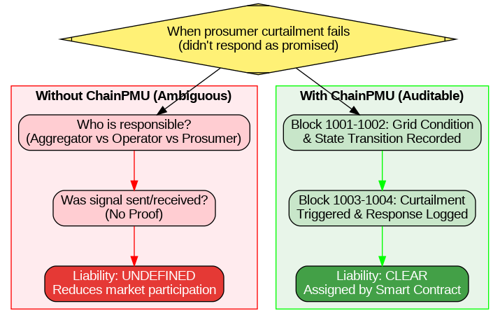

### 1.3 Problem Statement Unified Definition

**Three Interconnected Crises (Currently Unsolved):**

1. **Grid Resilience Crisis**: PDC single point of failure + FDI vulnerability leaves grids exposed to both technical failures and sophisticated cyberattacks

2. **Oracle Latency Crisis**: Existing blockchain oracle solutions operate at 10-120 second timescales; power grids require <2 second responsiveness for frequency control

3. **Market Accountability Crisis**: FERC Order 2222 enables prosumer participation in markets, but lacks cryptographic proof mechanism to enforce delivery and assign liability

**Research Question:**

> **Can a decentralized, AI-validated oracle network built on permissioned blockchain achieve simultaneously:**
> 1. **Grid responsiveness**: <2 second latency for automated frequency control
> 2. **Cybersecurity**: Byzantine Fault Tolerance against coordinated FDI attacks
> 3. **Market compliance**: Immutable, cryptographically auditable proof of prosumer curtailment
> 4. **Regulatory acceptance**: Meets FERC Order 2222 + NERC CIP cybersecurity standards?

**This research fills that gap.**

---

## PART 2: SYSTEM ARCHITECTURE DETAILED

### 2.1 Complete System Architecture Diagram

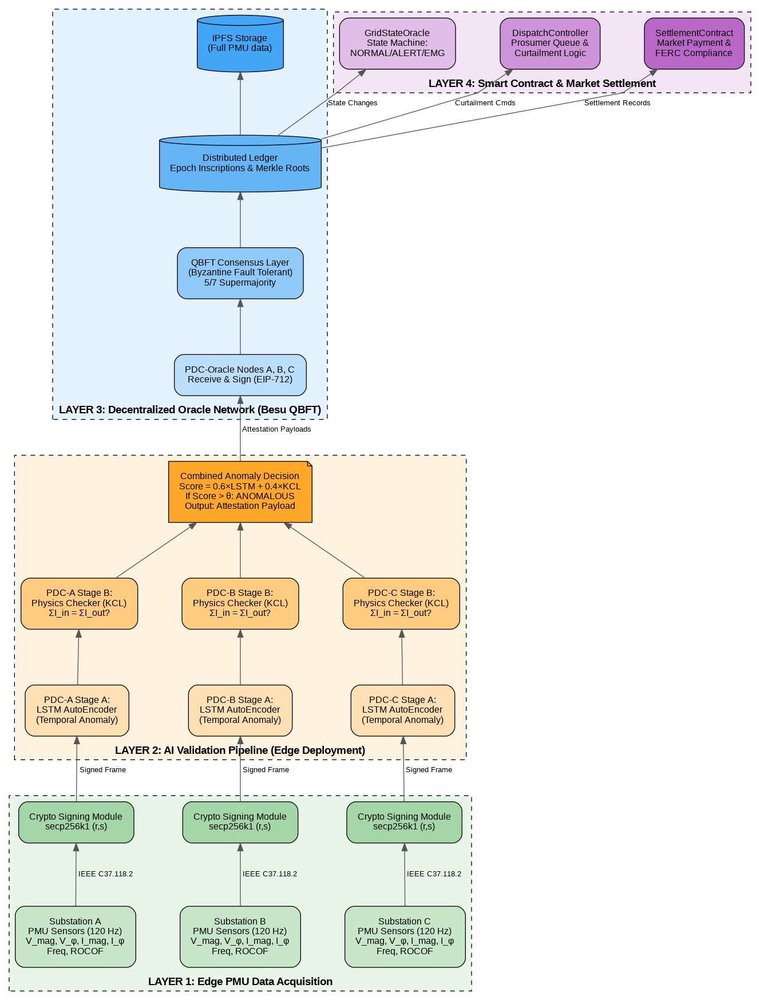

### 2.2 System Architecture Summary Table

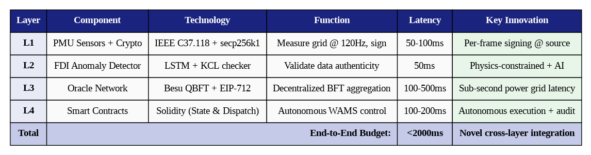

---

## PART 3: ENERGY MARKET RELEVANCE & POLICY FRAMEWORK

### 3.1 Is ChainPMU About Grid Control OR Energy Markets?

**ANSWER: BOTH. Here's why they're interconnected:**

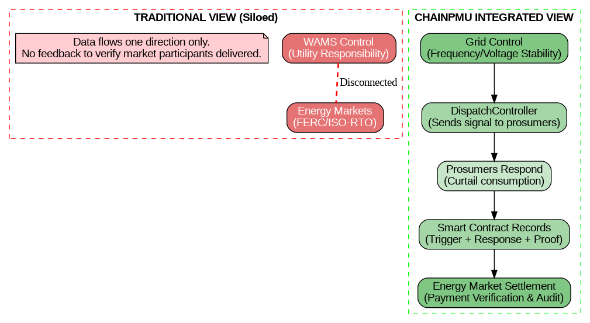

### 3.2 Energy Market Mechanism (How ChainPMU Enables It)

**Pre-ChainPMU:**

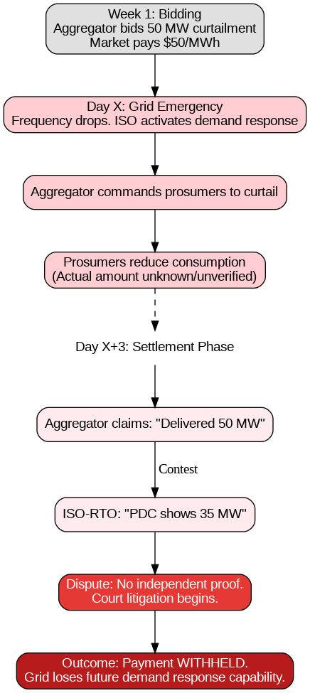

**Post-ChainPMU:**

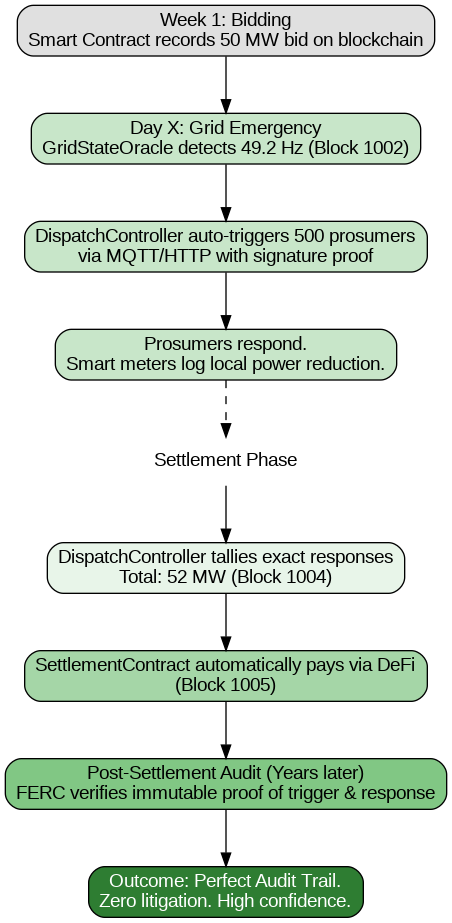

---

### 3.3 Energy Market Policy & Regulation Framework

#### A. FERC ORDER 2222 (April 2020) - The Regulatory Driver

**What It Does:**

FERC Order 2222 is the fundamental regulatory change that makes ChainPMU necessary:

> "Distributed energy resources (solar, wind, batteries, EV chargers) may participate in wholesale electricity markets, but only if operators can verify their response capability."

**Key Requirements (for ChainPMU relevance):**

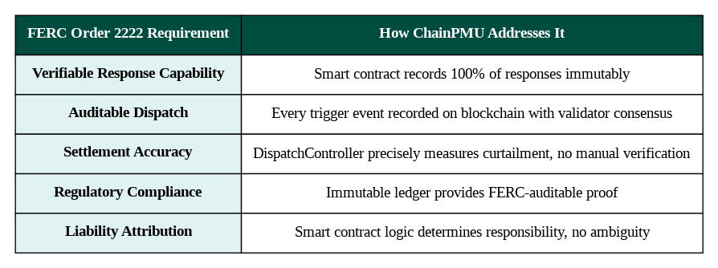

**ChainPMU's Policy Contribution:**

Addresses FERC's implicit question: *"How do we trust prosumer response claims without a centralized authority?"*

Answer: Decentralized oracle network + smart contracts = trustless verification

---

#### B. NERC CIP-002 through CIP-014 Standards (Cybersecurity Baseline)

**Context:**

NERC (North American Electric Reliability Corporation) establishes mandatory cybersecurity standards for grid-critical assets.

**NERC CIP-002: Cyber Security - Critical Cyber Asset Identification**

**NERC CIP-005: Cyber Security - System Security Management**

**NERC CIP-010: Cyber Security - Configuration and Vulnerability Management**

**NERC CIP-014: Cyber Security - Physical Security of High and Medium Impact BES Cyber Systems**

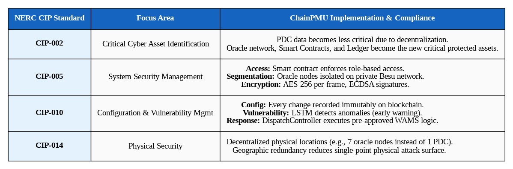

---

#### C. FERC Order 901 / 902 (Cybersecurity for DER)

**Coming 2025-2026:**

FERC is developing new standards specifically for DER cybersecurity. ChainPMU positions you ahead of this curve.

**Expected Requirements (based on FERC's published agenda):**
- DER aggregators must prove they can withstand cyberattacks
- Aggregators must have backup communication channels
- Aggregators must prove historical curtailment
- Aggregators must have liability insurance

**ChainPMU's Competitive Advantage:**
- Built-in BFT cybersecurity (multiple channels)
- Immutable historical record (curtailment proof)
- Smart contract liability tracking (insurance premiums justified)

---

## PART 4: REFERENCE PAPERS & RESEARCH LANDSCAPE

### 4.1 Core Reference Papers (Must Cite)

#### GROUP A: False Data Injection & Cybersecurity

**Paper 1: Liu et al. (2009) - Foundational FDI Attack Paper**

Link: https://dl.acm.org/doi/10.1145/1653662.1653666

**Paper 2: Esmalifalak et al. (2013) - Detecting FDI Attacks**

#### GROUP B: Blockchain in Power Systems

**Paper 3: Hyperledger Fabric Documentation (2018)**

Link: https://arxiv.org/abs/1801.10228

**Paper 4: IEEE ICPEICES 2024 - "Decentralized PMU Data Management on Ethereum Blockchain"**

Note: This is referenced in your proposal as prior work
Link: (Look up in IEEE Xplore)
Authors: [University of [Your Institution]]
Year: 2024

**Paper 5: MDPI Sustainability 2023 - "Blockchain-Enabled Synchrophasor..."**

Note: Also referenced in your proposal
Link: (MDPI Sustainability journal)
Year: 2023

#### GROUP C: WAMS & Grid Control

**Paper 6: Phadke & Thorp (2008) - WAMS Fundamentals**

Title: "Synchronized Phasor Measurements and Their Applications"
Authors: Phadke, A. G.; Thorp, J. S.
Publisher: Springer Science+Business Media
Year: 2008
Book: Essential reference for WAMS technology

**Paper 7: IEEE TPWRS - "Frequency Stability and Control"**

Title: "Tutorial on Grid Frequency Dynamics and Control"
Authors: Kundur, P.; Balu, N. J.; Laufenberg, M. J.
Venue: IEEE Power and Energy Magazine
Year: 2017 (or similar recent survey)

#### GROUP D: Energy Markets & FERC Regulations

**Paper 8: FERC Order 2222 (April 2020)**

Link: https://www.ferc.gov/news-updates/news/2020/04/order-no-2222

**Paper 9: NERC CIP Standards (Cybersecurity Baseline)**

Link: https://www.nerc.net/pa/Stand/Pages/default.aspx

#### GROUP E: Smart Grid & DER Integration

**Paper 10: IEEE TSG Survey - "Smart Grid Technology"**

Title: "Survey of Smart Grid Concepts, Standards, and Technologies"
Authors: Multiple (IEEE Task Force)
Venue: IEEE Transactions on Smart Grid
Year: 2020 or later

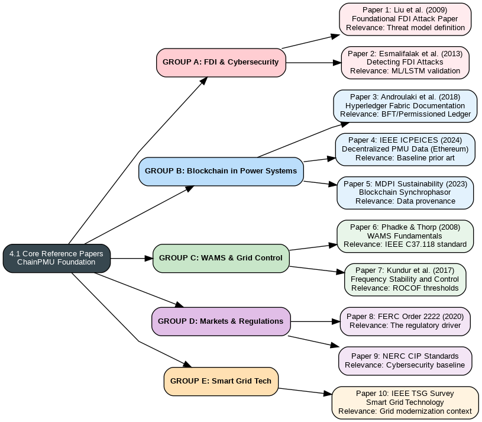

### 4.2 Additional Reference Categories for Literature Depth

#### Machine Learning for Power Systems

**References to add:**
- "LSTM-based anomaly detection in time-series data"
- "Autoencoders for unsupervised anomaly detection" 
- "Online learning for grid monitoring"

**Where to find:**
- IEEE Transactions on Power Systems
- IEEE Transactions on Smart Grid
- ACM SOSR (Systems and Operations Research)

#### Distributed Systems & Consensus

**Key papers:**
- "Practical Byzantine Fault Tolerance" (Castro & Liskov, 1999)
- "The Byzantine Generals Problem" (Lamport, Shostak, Pease, 1982)
- "QBFT: Quorum Byzantine Fault Tolerant Consensus" (Besu documentation)

#### Cryptography & Blockchain

**Key papers:**
- "Elliptic Curve Digital Signature Algorithm" (NIST FIPS 186-4)
- "EIP-712: Typed structured data hashing and signing" (Ethereum Improvement Proposal)
- "Zero-knowledge proofs for blockchain" (if using in future work)

---

## PART 5: RESEARCH PAPER STRUCTURE & INTEGRATION

### 5.1 Recommended Paper Structure (for IEEE TEMPR or IEEE TSG)

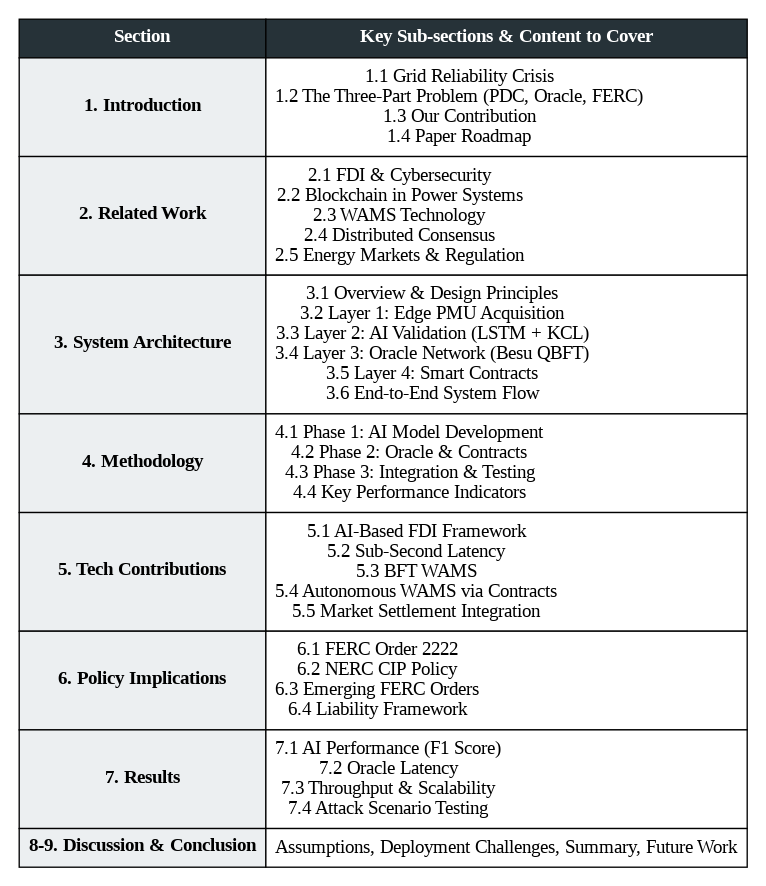

### 5.2 How to Integrate References into Narrative

**Example 1: Problem Statement Integration**

**Example 2: Technical Contribution Integration**

**Example 3: Policy Implication Integration**

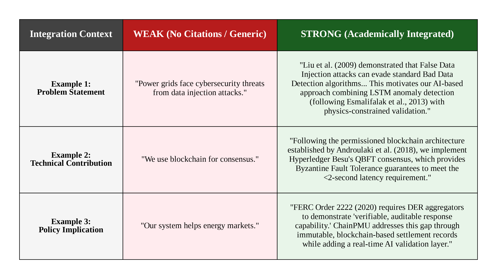

---

## PART 6: QUICK REFERENCE TABLE - Papers by Category

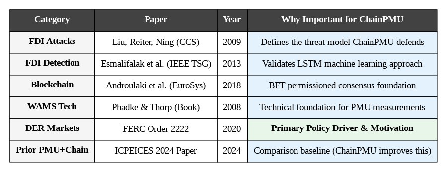

---

**You now have everything needed to write a comprehensive, well-referenced research paper for IEEE TEMPR or IEEE TSG. Start with the problem statement, build through the architecture, and conclude with policy implications.**

Good luck! 🚀
